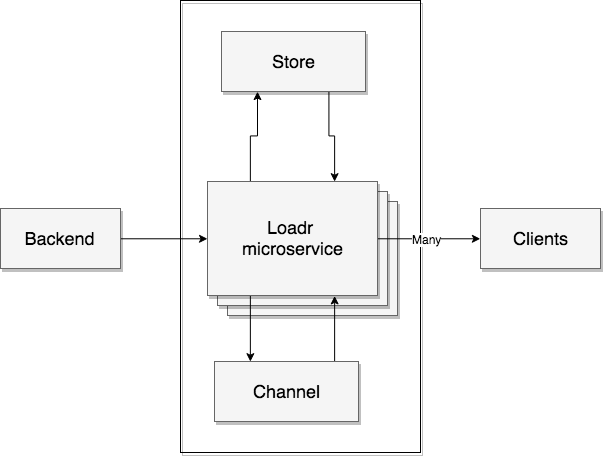

Ready to use microservice for task progress communication

## Overview

#### High level


The backend workers send the progress to the `loadr` service which in turn makes sure all interested clients receive the new state.

#### A bit more details


When the `loadr` service receives the new progress it writes it to a `Store` (for now `MongoDB`) after which it's dispatched to all the service instances using a `Channel` (`Redis` pub/sub). 
When receiving the new progress from the `Channel` all connected clients are notified.

Note: The `Store` and `Channel` components are swappable. New implementations using `PostgreSQL` and `RabbitMQ` can be easily added.


## Local testing

```bash
docker-compose up --scale loadr=3 -d --build
```

This will start 3 services listening on different ports. Clients can connect to any node to listen for progress changes and the backend can post progress updates to any node.

Note: Load balancer not included