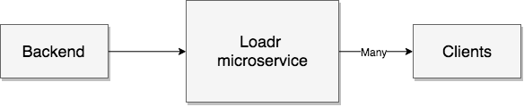

Ready to use microservice for task progress communication

## Local testing

```bash
docker-compose up --scale loadr=3 -d --build
```

This will start 3 services listening on different ports. Clients can connect to any node to listen for progress changes and the backend can post progress updates to any node.

Note: Load balancer not included

## Overview



The backend workers send the progress to the `loadr` service which in turn makes sure all interested clients receive the new state.